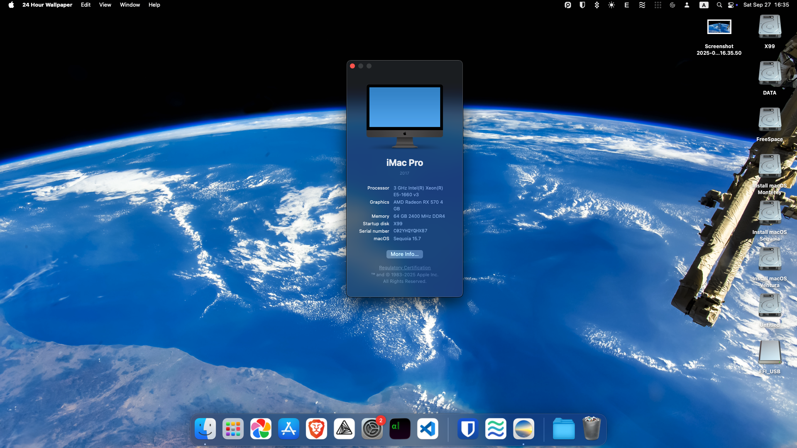
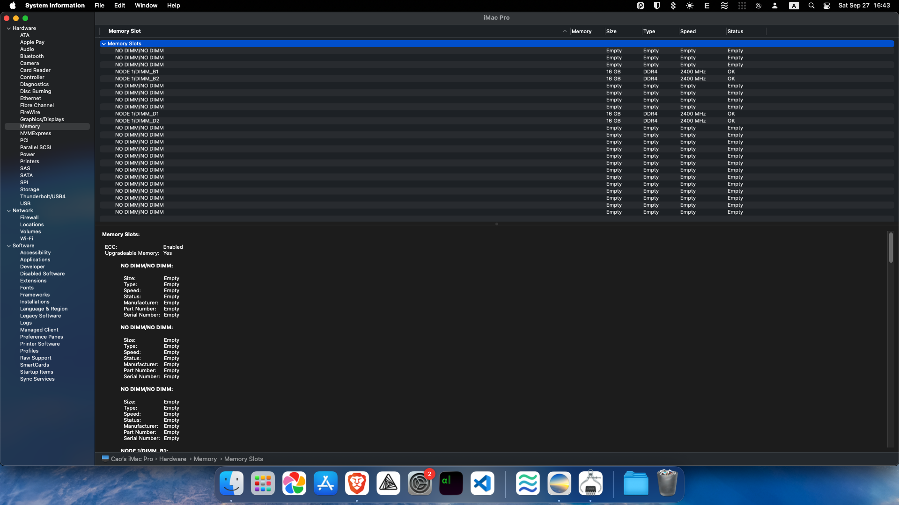
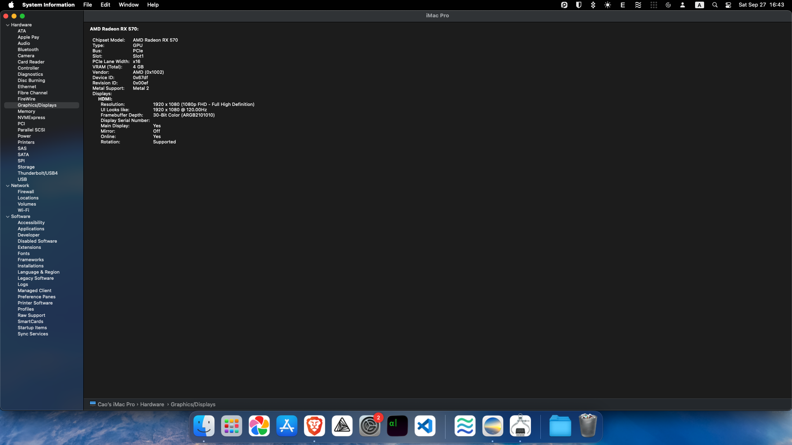
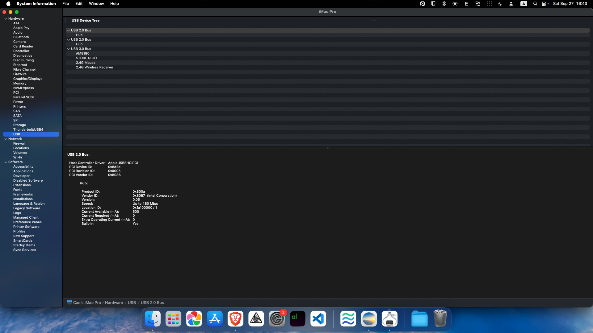
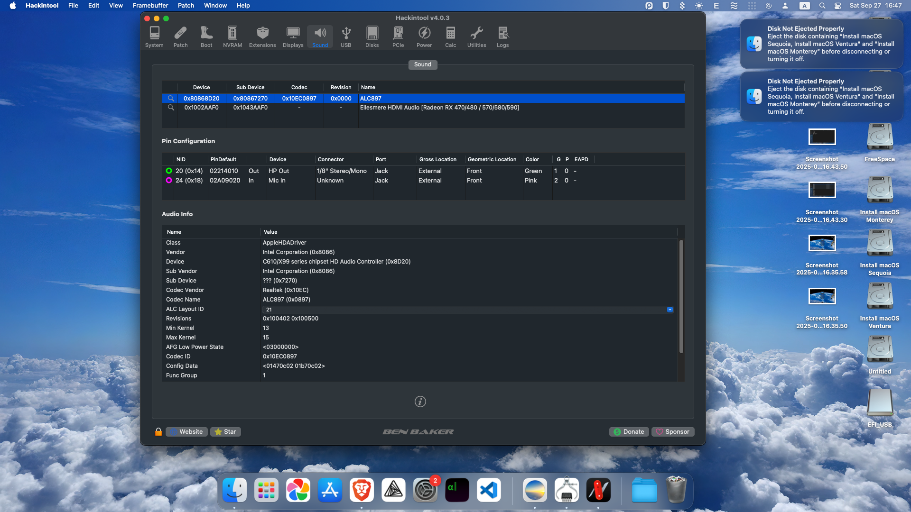

# OpenCore for Qiyida X99-D4 Motherboard

OpenCore EFI configurations for the Qiyida X99-D4 Chinese motherboard, enabling macOS Hackintosh installation and operation.

## 📋 Table of Contents

- [OpenCore for Qiyida X99-D4 Motherboard](#opencore-for-qiyida-x99-d4-motherboard)
  - [📋 Table of Contents](#-table-of-contents)
  - [🚀 Latest Version: OpenCore-20260131 (RECOMMENDED)](#-latest-version-opencore-20260131-recommended)
    - [**OpenCore-20260131** - Minor fixes](#opencore-20260131---minor-fixes)
  - [📦 Version History](#-version-history)
    - [**OpenCore-20250927** - Full Working Build](#opencore-20250927---full-working-build)
    - [**OpenCore-20241124** - Legacy Build](#opencore-20241124---legacy-build)
  - [📋 System Requirements](#-system-requirements)
    - [Build Specifications](#build-specifications)
  - [📸 Screenshots](#-screenshots)
    - [About This Mac](#about-this-mac)
    - [System Information](#system-information)
  - [🛠️ Installation Guide](#️-installation-guide)
  - [🙏 Credits](#-credits)
  - [⚠️ Disclaimer](#️-disclaimer)
  - [📝 Changelog](#-changelog)
    - [OpenCore-20260131](#opencore-20260131)
    - [OpenCore-20250927](#opencore-20250927)
    - [OpenCore-20241124](#opencore-20241124)

## 🚀 Latest Version: OpenCore-20260131 (RECOMMENDED)

### **[OpenCore-20260131](./OpenCore-20260131)** - Minor fixes

- **Status**: ✅ **FULLY FUNCTIONAL**
- **OpenCore Version**: Latest(1.0.5)
- **macOS Support**: Sequoia 15.x
- **BIOS**: Custom modified BIOS by [jwagnervaz](https://github.com/jwagnervaz/QIYIDA-X99-D4-V2.0)

**What's Working:**

- ✅ All SATA Ports
- ✅ All USB Ports (USB2 and USB3)
- ✅ Onboard Ethernet (Realtek RTL8111)
- ✅ Onboard Audio
- ✅ M.2 NVME Slot
- ✅ Sleep/Wake

### **[OpenCore-20250927](./OpenCore-20250927)** - Full Working Build

- **Status**: ✅ **FULLY FUNCTIONAL**
- **OpenCore Version**: Latest(1.0.5)
- **macOS Support**: Sequoia 15.x
- **BIOS**: Custom modified BIOS by [jwagnervaz](https://github.com/jwagnervaz/QIYIDA-X99-D4-V2.0)

**What's Working:**

- ✅ All SATA Ports
- ✅ All USB Ports (USB2 and USB3)
- ✅ Onboard Ethernet (Realtek RTL8111)
- ✅ Onboard Audio
- ✅ M.2 NVME Slot
- ✅ Sleep/Wake

## 📦 Version History

### **[OpenCore-20241124](./OpenCore-20241124)** - Legacy Build

- **Status**: ⚠️ **PARTIALLY WORKING**
- **OpenCore Version**: 1.0.2
- **macOS Support**: Sequoia 15.x
- **BIOS**: Huananzhi X99-F8 BIOS (compatibility issues)

**Issues with this version:**

- ❌ Stock BIOS doesn't work (ExitBS kernel panic)
- ❌ SATA2, SATA4 Ports not working
- ❌ Ethernet port not working
- ⚠️ Requires Huananzhi X99-F8 BIOS flash (device path differences)

## 📋 System Requirements

### Build Specifications

- **Motherboard**: Qiyida X99-D4 ([Review](https://theoverclockingpage.com/2024/04/21/review-qiyida-x99-d4-an-affordable-chinese-motherboard-for-xeon-with-white-pcb/?lang=en))
- **CPU**: Intel Xeon E5-1660v3 (or compatible)
- **RAM**: 64GB = 4×16GB DDR4 DIMM 2400MHz
- **GPU**: AMD RX570 4GB (or compatible)
- **Storage**: 512GB SATA SSD

## 📸 Screenshots

### About This Mac

### System Information

## 🛠️ Installation Guide

1. **Choose Your Version**:

   - **Recommended**: Use [OpenCore-20260131](./OpenCore-20260131) or [OpenCore-20250927](./OpenCore-20250927) for full functionality
   - **Legacy**: Use [OpenCore-20241124](./OpenCore-20241124) if you prefer the older build

2. **BIOS Requirements**:

   - **OpenCore-20260131**: Requires custom BIOS flash (fully functional)
   - **OpenCore-20250927**: Requires custom BIOS flash (fully functional)
   - **OpenCore-20241124**: Requires Huananzhi X99-F8 BIOS flash (limited functionality)

3. **Follow the specific README and BIOS guides in each version folder**

## 🙏 Credits

- **jwagnervaz**: Custom BIOS development and modifications - [QIYIDA-X99-D4-V2.0](https://github.com/jwagnervaz/QIYIDA-X99-D4-V2.0)
- **OpenCore Team**: OpenCore bootloader development
- **Acidanthera**: Kext development and maintenance
- **Dortania**: OpenCore installation guides and documentation
- **Community Contributors**: Testing and feedback

## ⚠️ Disclaimer

- **BIOS Flashing**: Flash BIOS at your own risk. Always backup your original BIOS.
- **Hardware Compatibility**: Results may vary depending on your specific hardware configuration.
- **macOS Licensing**: Ensure you comply with Apple's Software License Agreement.

## 📝 Changelog

### OpenCore-20260131

- ✅ Added ACPI Patches from SSDTime.
- ✅ Added CPUFriend + CPUFriendDataProvider.

### OpenCore-20250927

- ✅ Full hardware compatibility achieved
- ✅ Custom BIOS integration by jwagnervaz
- ✅ All ports and devices working
- ✅ Improved stability and performance

### OpenCore-20241124

- ⚠️ Initial working build with limitations
- ⚠️ Partial hardware support
- ⚠️ Requires alternative BIOS for basic functionality

---

**For detailed installation instructions, BIOS flashing guides, and configuration details, please refer to the README files in the respective version folders.**
